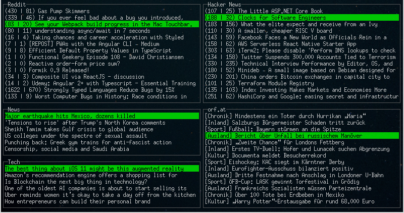

# O shit waddup
Waddup is a tool to get an aggregated developer news feed to the command line so it's available as a quick 5min update during your day.

I've removed the graph and added a rss feed reader instead.

## Usage
`node dist/index.js`

Scroll through the boxes to find an item you want to read, click to select / open.

## Things I'm working on

* Arrow keys to navigate, return to select item, N/P to jump between boxes
* Do something more useful/fun with the NXT/USD graph
